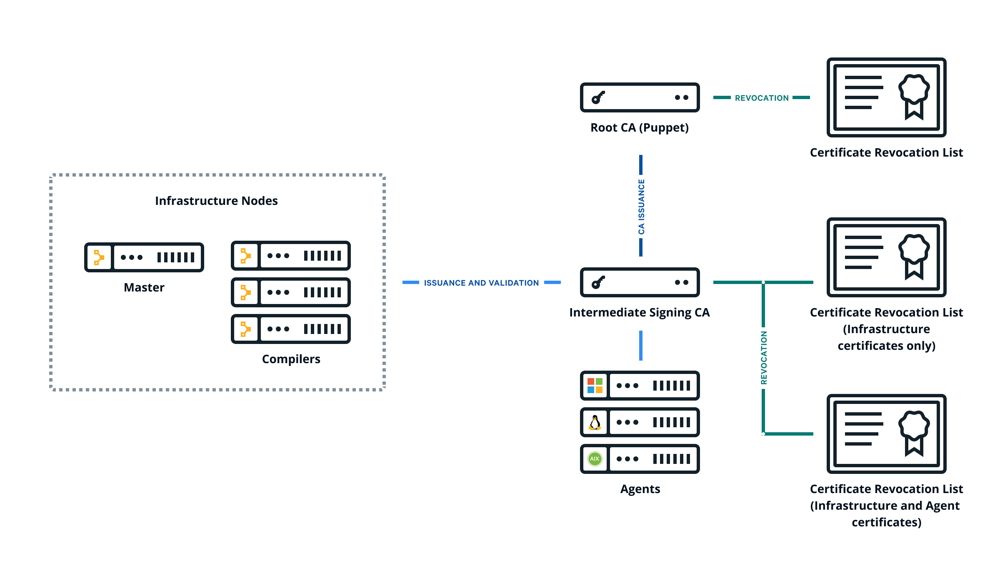
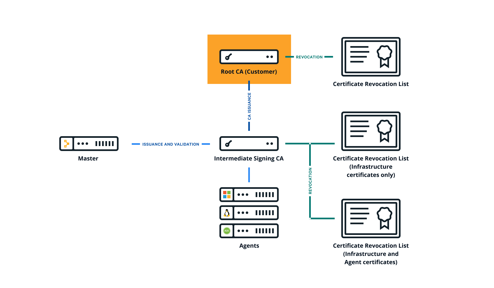

Before starting OpenVox Server for the first time, you need to initialize the CA. How you do
that depends on whether you want OpenVox to manage your CA or whether you have an existing
external CA.

**OpenVox manages your CA:**
Run `puppetserver ca setup` to generate an intermediate CA with all necessary certificates and keys.

The following diagram shows the configuration of OpenVox’s basic certificate infrastructure.



**You have an external certificate authority:**
An external certificate authority is your organization's own PKI infrastructure, managed
independently of OpenVox. Create a cert chain from it and use `puppetserver ca import` to
install the chain on your server.
OpenVox agents handle an intermediate CA out of the box — no need to copy files around by hand
or configure CRL checking.

If you skip both commands and start OpenVox Server directly, the server will generate a
non-intermediate CA for backward compatibility. This configuration is not recommended for
new deployments.

If the host is already managed as an agent of another OpenVox server while you set up its CA,
OpenVox Server replaces the agent's CRL with the new CA's CRL each time it starts, and agent runs fail. See
[When the agent on the server host trusts a different CA](puppet_conf_setting_diffs.html#when-the-agent-on-the-server-host-trusts-a-different-ca).

## Where to set CA configuration

All CA configuration takes place in OpenVox’s config file. See the [OpenVox Configuration Reference](/openvox/latest/configuration.html) for details.

## Set up OpenVox as an intermediate CA with an external root

OpenVox Server needs to present the full certificate chain to clients so the client can authenticate the
server. You construct the certificate chain by concatenating the CA certificates within a PEM file, starting with
the new intermediate CA certificate and descending to the root CA certificate.

The following diagram shows the configuration of OpenVox’s certificate infrastructure with an external root.



To set up OpenVox as an intermediate CA with an external root:

1. Collect your organization’s chain of trust. This includes:
   - The root cert
   - Any intermediate CA certs
   - The CA cert that you will use to issue a CA signing cert for your OpenVox infrastructure
1. Collect the corresponding CRLs for each of these certificates. Take note of the expiration dates of each
   CRL. When one expires, you need to refresh it for OpenVox to continue working.
1. Create a private RSA key (minimum 2048-bit) with no passphrase for the OpenVox CA — you will need to
   import it into your OpenVox infrastructure later. `puppetserver ca import` requires the key to be
   unencrypted.
1. Create a CSR for the OpenVox CA and sign it with SHA-256 using the appropriate cert from your
   organization’s trust chain, which you gathered in Step 1. This is the new OpenVox CA cert, which will
   be used to sign all other OpenVox infrastructure certs. The signed cert must have the following
   extensions set:
   - `basicConstraints: CA:TRUE` (critical)
   - `keyUsage: keyCertSign, cRLSign` (critical)
   - `subjectKeyIdentifier: hash`
   - `authorityKeyIdentifier: keyid:always`
1. Create a CRL for the new OpenVox CA cert.
1. Concatenate all of the certs into a PEM file, starting with the new OpenVox CA cert and ending with your
   organization’s root cert. The file should contain the PEM-encoded certs, like this:

   ```text
   -----BEGIN CERTIFICATE-----
   <OpenVox’s CA cert>
   -----END CERTIFICATE-----
   -----BEGIN CERTIFICATE-----
   <Org’s intermediate CA signing cert>
   -----END CERTIFICATE-----
   -----BEGIN CERTIFICATE-----
   <Org’s root CA cert>
   -----END CERTIFICATE-----
   ```

1. Concatenate all of the CRLs into a PEM file, in the same order as the certificates. The file should
   contain the PEM-encoded CRLs, like this:

   ```text
   -----BEGIN X509 CRL-----
   <OpenVox’s CA CRL>
   -----END X509 CRL-----
   -----BEGIN X509 CRL-----
   <Org’s intermediate CA CRL>
   -----END X509 CRL-----
   -----BEGIN X509 CRL-----
   <Org’s root CA CRL>
   -----END X509 CRL-----
   ```

1. Use the `puppetserver ca import` command to trigger the rest of the CA setup:

   ```bash
   puppetserver ca import --cert-bundle ca-bundle.pem --crl-chain crls.pem --private-key openvox_ca_key.pem
   ```
